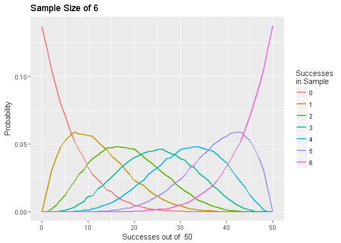

Hypergeometric Monte Carlo
================

This is a Monte Carlo sampling of the hypergeometric distribution

First load the libraries we will use

``` r
library(clusterSim)
library(ggplot2)
library(reshape2)
```

Information on R's hypergeometric distribution function can be found using this command

``` r
#?Hypergeometric
```

A function to Monte Carlo sample from a hypergeometric distribution

``` r
##  hg_mc - a function that monte carlo samples from a hypergeometric distribution
##  For each x in N, where N is the population size and x is the true number of successes in N, 
##  this function will draw a sample of specified size (@sample) a number of times(@trials). 
##  @N - total population size
##  @samples - the number of samples drawn 
##  @trials - the number of times to perform independent random draws
##  @returns a dataframe witn N+1 columns (b/c 0 is included) and samples+1 rows (O included)

hg_mc<-function(samples, N, trials){
  df <- NULL
  for (i in 0:N){
    df <- cbind(df, rhyper(trials, i, N-i, samples))
  }
  return(as.data.frame(df))
}
```

A helper function to aggregate the raw data from the simulations

``` r
#helper function to aggregate successes 

sums <- function(samples, df){
  sums<- NULL
  for (i in 1:(ncol(df))){
    res <- c()
    for (j in 0:samples){
      res <- c(res, sum(df[ ,i] == j))
    }
    sums <- cbind(sums, res)
  }
  return(sums)
}
```

Some plotting functions

``` r
##  plotting function
##  df is a dataframe of normalized aggregate successes from simulation
pdf_plot <- function(df, N){
  sample_size = ncol(df)-1
  test <- df
  test['successes'] <- 0:N
  melted = melt(test, id.vars="successes")
  ggplot() + 
    geom_line(data=melted, aes(x=successes, y=value, group=variable, color = variable), size=1) +
    labs(title=paste("Sample Size of", sample_size, " "), x =paste("Successes out of ", toString(N), sep=" "), y = "Probability") +
    guides(color=guide_legend(title="Successes\nin Sample"))
}

##  To plot the distribution of successes in samples for a specified number of successes in the population
 
draw_dist_plot <-function(successes, df, N){
  sample_size = nrow(df) -1
  df <- df[c(successes, 'count')]
  melted <- melt(df, id.vars='count')
  ggplot(data=melted, aes(x=count, y=value, fill=variable)) +
    geom_bar(stat="identity", position=position_dodge()) +
    labs(title=paste('Probability of successes in sample when true population successes are \n ', toString(successes), ' out of ', N), x=paste('Successes in sample size of ', sample_size), y='Probability Density') +
    stat_smooth(aes(color=variable), method='auto', se = FALSE)
  
}
```

Run the simulations. Here we have a population of 50, sample size of 6, and 10,000 trials.

``` r
## Set desired parameters for the simulation
samples <- 6  # sample size
N <- 50 # population size 
trials <- 10000 # number of trials

##  run the simulation
raw_data = hg_mc(samples, N, trials)

##  aggregate the data and rename the rows and cols
aggregated_data = sums(samples, raw_data)
colnames(aggregated_data) <- 0:N
rownames(aggregated_data) <- 0:samples
```

Look at the aggregated data. Each row is the observed number of successes. Each column is the true number of successes in the population.

``` r
print(aggregated_data)
```

    ##       0    1    2    3    4    5    6    7    8    9   10   11   12   13
    ## 0 10000 8856 7702 6757 5846 5195 4466 3823 3359 2965 2396 2034 1741 1498
    ## 1     0 1144 2167 2873 3473 3805 4072 4274 4177 4153 4094 4045 3761 3530
    ## 2     0    0  131  362  639  910 1281 1644 2025 2241 2616 2867 3048 3239
    ## 3     0    0    0    8   42   86  170  238  398  559  807  883 1220 1382
    ## 4     0    0    0    0    0    4   11   20   37   76   83  159  215  325
    ## 5     0    0    0    0    0    0    0    1    4    5    4   12   14   26
    ## 6     0    0    0    0    0    0    0    0    0    1    0    0    1    0
    ##     14   15   16   17   18   19   20   21   22   23   24   25   26   27
    ## 0 1174 1100  857  692  569  485  368  299  237  163  136  115   83   66
    ## 1 3340 3006 2788 2559 2270 2003 1683 1533 1405 1158  985  845  668  577
    ## 2 3430 3454 3529 3490 3456 3420 3389 3207 2948 2769 2570 2336 2138 1944
    ## 3 1634 1868 2105 2347 2562 2765 2932 3034 3170 3252 3289 3357 3380 3246
    ## 4  385  500  628  766  950 1117 1302 1535 1728 2012 2217 2389 2601 2870
    ## 5   36   69   89  139  183  199  306  365  463  571  711  831  986 1128
    ## 6    1    3    4    7   10   11   20   27   49   75   92  127  144  169
    ##     28   29   30   31   32   33   34   35   36   37   38   39   40   41
    ## 0   48   39   14   15    8    9    4    5    1    1    0    0    0    0
    ## 1  457  384  321  233  174  121   86   69   40   44   19   11    5    2
    ## 2 1809 1491 1312 1121  977  764  604  508  411  300  239  162   97   56
    ## 3 3159 3060 2867 2801 2517 2384 2089 1895 1684 1385 1219  985  758  604
    ## 4 2928 3135 3364 3406 3449 3513 3488 3413 3346 3271 3090 2846 2656 2294
    ## 5 1379 1586 1745 1987 2342 2515 2850 3089 3290 3577 3746 3942 4043 4220
    ## 6  220  305  377  437  533  694  879 1021 1228 1422 1687 2054 2441 2824
    ##     42   43   44   45   46   47   48   49    50
    ## 0    0    0    0    0    0    0    0    0     0
    ## 1    4    0    0    0    0    0    0    0     0
    ## 2   44   17    8    1    2    0    0    0     0
    ## 3  418  264  164  107   35    9    0    0     0
    ## 4 1932 1623 1313  899  628  389  105    0     0
    ## 5 4271 4300 4054 3840 3391 2874 2227 1149     0
    ## 6 3331 3796 4461 5153 5944 6728 7668 8851 10000

Plot of each sample success distribution over true successes in population

``` r
##  normalize the results by successes in N to get a pdf
agg_data_normed <- data.Normalization(aggregated_data, type = "n10", normalization = "row")

##  plot the pdf's of the draw successes.  Data parameter is transposed and ensured to be a dataframe
pdf_plot(as.data.frame(t(agg_data_normed)), N)
```



We can also plot the distribution of the sample for a specified number of true successes in the population

``` r
##  Plot entire sample distribution for x successes in N. Choose x (can choose more than one to compare)
x=c(25, 30)
##  first normalize by sample to get pmf and add successes column
samples_normed <- as.data.frame(data.Normalization(aggregated_data, type = "n10", normalization = "col"))
samples_normed['count'] = c(0:(nrow(samples_normed)-1))
##  plot the distribution over successes in draws for specified successes in N
draw_dist_plot(x, samples_normed, N)
```


