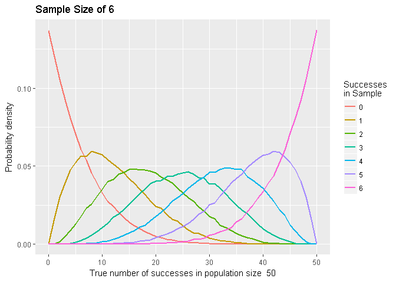
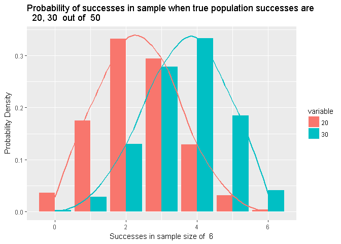
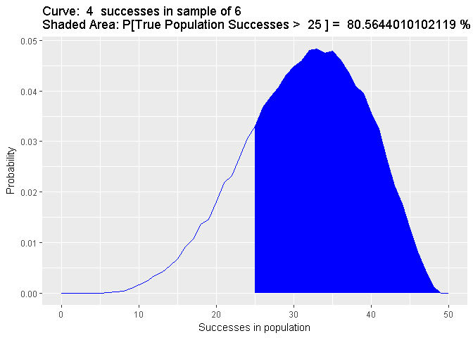

Hypergeometric Monte Carlo
================

This is a Monte Carlo sampling of the hypergeometric distribution

First load the libraries we will use

``` r
library(clusterSim)
library(ggplot2)
library(reshape2)
```

Information on R's hypergeometric distribution function can be found using this command

``` r
#?Hypergeometric
```

A function to Monte Carlo sample from a hypergeometric distribution

``` r
##  hg_mc - a function that monte carlo samples from a hypergeometric distribution
##  For each x in N, where N is the population size and x is the true number of successes in N, 
##  this function will draw a random sample of specified size (@sample) a specified number of times(@trials). 
##  @N - total population size
##  @samples - the number of samples drawn 
##  @trials - the number of times to perform independent random draws
##  @returns a dataframe witn N+1 columns (b/c 0 is included) and @samples+1 rows (O included)

hg_mc<-function(samples, N, trials){
  df <- NULL
  for (i in 0:N){
    df <- cbind(df, rhyper(trials, i, N-i, samples))
  }
  return(as.data.frame(df))
}
```

A helper function to aggregate the raw data from the simulations

``` r
#helper function to aggregate successes 

sums <- function(samples, df){
  sums<- NULL
  for (i in 1:(ncol(df))){
    res <- c()
    for (j in 0:samples){
      res <- c(res, sum(df[ ,i] == j))
    }
    sums <- cbind(sums, res)
  }
  return(sums)
}
```

First we set the parameters we want. Here we set a population of 50, sample size of 6, and 10,000 trials.

``` r
## Set desired parameters for the simulation
samples <- 6  # sample size
N <- 50 # population size 
trials <- 10000 # number of trials
```

We now run the simulation and aggregate the raw data

``` r
##  run the simulation
raw_data = hg_mc(samples, N, trials)

##  aggregate the data and rename the rows and cols
aggregated_data = sums(samples, raw_data)
colnames(aggregated_data) <- 0:N
rownames(aggregated_data) <- 0:samples
```

Let's look at the aggregated data. Each row is the observed number of successes in the sample. Each column is the true number of successes in the population.

``` r
print(aggregated_data)
```

    ##       0    1    2    3    4    5    6    7    8    9   10   11   12   13
    ## 0 10000 8799 7753 6809 5715 5042 4437 3889 3408 2862 2414 2009 1782 1473
    ## 1     0 1201 2130 2847 3627 3910 4107 4201 4191 4197 4118 3979 3797 3589
    ## 2     0    0  117  335  616  935 1270 1636 1969 2319 2639 2863 3014 3200
    ## 3     0    0    0    9   42  111  179  252  399  549  705  958 1148 1410
    ## 4     0    0    0    0    0    2    6   22   32   69  117  177  249  299
    ## 5     0    0    0    0    0    0    1    0    1    4    7   13    9   29
    ## 6     0    0    0    0    0    0    0    0    0    0    0    1    1    0
    ##     14   15   16   17   18   19   20   21   22   23   24   25   26   27
    ## 0 1276 1023  824  726  568  485  377  298  271  194  126  105   93   75
    ## 1 3297 3021 2787 2594 2308 2046 1794 1582 1372 1141  948  884  683  587
    ## 2 3321 3503 3450 3460 3443 3456 3234 3079 3006 2831 2519 2387 2200 1893
    ## 3 1679 1889 2177 2303 2516 2712 2961 3030 3188 3259 3356 3279 3253 3246
    ## 4  391  494  666  776  993 1067 1314 1597 1696 1959 2234 2400 2682 2825
    ## 5   36   65   91  132  158  223  295  375  428  550  732  852  965 1217
    ## 6    0    5    5    9   14   11   25   39   39   66   85   93  124  157
    ##     28   29   30   31   32   33   34   35   36   37   38   39   40   41
    ## 0   54   38   20   19   19    8    3    3    2    2    0    0    0    0
    ## 1  499  384  287  203  149  128   94   52   41   43   26   11    7    2
    ## 2 1763 1545 1388 1113  941  761  611  527  422  303  213  170   89   58
    ## 3 3134 3015 2844 2810 2513 2369 2126 1851 1600 1406 1221  934  743  556
    ## 4 2966 3145 3268 3344 3495 3520 3456 3489 3371 3191 2978 2884 2592 2358
    ## 5 1345 1585 1832 2065 2291 2512 2826 3088 3295 3604 3861 3951 4186 4175
    ## 6  239  288  361  446  592  702  884  990 1269 1451 1701 2050 2383 2851
    ##     42   43   44   45   46   47   48   49    50
    ## 0    0    0    0    0    0    0    0    0     0
    ## 1    2    1    0    0    0    0    0    0     0
    ## 2   36   26    7    4    1    0    0    0     0
    ## 3  413  266  186   97   42   11    0    0     0
    ## 4 1935 1549 1283  937  597  333   98    0     0
    ## 5 4336 4244 4109 3873 3520 2917 2098 1199     0
    ## 6 3278 3914 4415 5089 5840 6739 7804 8801 10000

Let's create some plots to help visualize the data First we write a function to plot the the distribution of the observed successes in a sample over the true number of successes in the population.

``` r
##  plotting function
##  df is a dataframe of normalized aggregate successes from simulation
pdf_plot <- function(df, N){
  sample_size = ncol(df)-1
  test <- df
  test['successes'] <- 0:N
  melted = melt(test, id.vars="successes")
  ggplot() + 
    geom_line(data=melted, aes(x=successes, y=value, group=variable, color = variable), size=1) +
    labs(title=paste("Sample Size of", sample_size, " "), x =paste("True number of successes in population size ", toString(N), sep=" "), y = "Probability density") +
    guides(color=guide_legend(title="Successes\nin Sample"))
}
```

Call the plotting function

``` r
##  normalize the results by successes in N to get a pdf
agg_data_normed <- data.Normalization(aggregated_data, type = "n10", normalization = "row")

##  plot the pdf's of the draw successes.  Data parameter is transposed and ensured to be a dataframe
pdf_plot(as.data.frame(t(agg_data_normed)), N)
```



This next plotting function is to examine the distribution of sample successes for a specific number of successes in the population. Multiple population successes are allowed for comparison.

``` r
##  To plot the distribution of successes in samples for a specified number of successes in the population
##  @successes - the number of successes in the population
##  @df - a data frame containing the data
##  @N - the population size
 
draw_dist_plot <-function(successes, df, N){
  sample_size = nrow(df) -1
  df <- df[c(successes, 'count')]
  melted <- melt(df, id.vars='count')
  ggplot(data=melted, aes(x=count, y=value, fill=variable)) +
    geom_bar(stat="identity", position=position_dodge()) +
    labs(title=paste('Probability of successes in sample when true population successes are \n ', toString(successes), ' out of ', N), x=paste('Successes in sample size of ', sample_size), y='Probability Density') +
    stat_smooth(aes(color=variable), method='auto', se = FALSE)
}
```

We first set the population successes that we want to look at. Here we choose 20 and 30.

``` r
##  Plot entire sample distribution for x successes in N. Choose x (can choose more than one to compare)
successes=c(20, 30)
```

We normalize the data and call the plotting function

``` r
##  first normalize by sample to get pmf and add successes column
samples_normed <- as.data.frame(data.Normalization(aggregated_data, type = "n10", normalization = "col"))
samples_normed['count'] = c(0:(nrow(samples_normed)-1))
##  plot the distribution over successes in draws for specified successes in N
draw_dist_plot(successes, samples_normed, N)
```

 If we want to examine a specific number of successes in a sample and find the likelihood of the true number of population successes we can plot the sample and sum the area under the curve. This function does that for the right tail of the distribution.

``` r
right_tail_plot <- function(df, sample_successes, pop_successes){
  sample_successes <- sample_successes +1
  df1 <- as.data.frame(t(df))
  df1['successes'] <- c(0:(nrow(df1)-1))
  shade <- df1[(pop_successes+1):nrow(df1),]
  prob <- 100* sum(shade[,sample_successes])
  ggplot(data=df1, aes(x=successes)) + geom_line(aes(y=df1[,sample_successes]), color='blue') + 
    geom_area(data=shade, aes(x=pop_successes:(nrow(df1)-1), y=shade[,sample_successes]), fill='blue') +
    labs(title=paste('Curve: ', sample_successes-1,' successes in sample of', toString(nrow(df)-1), '\nShaded Area: P[True Population Successes > ',
                     pop_successes, '] = ', prob, '%'), x='Successes in population', 
         y='Probability')
}
```

We then call the function based on the parameters we want to see. Here we are looking at 4 successes in the sample size of 6 where we want to know the probability that the true number of successes in the population is greater than 25

``` r
##  parameters for plotting function
sample_successes <- 4 # number of successes in sample
pop_successes <- 25 # probability that true population successes are greater than this when observing sample_successes

right_tail_plot(agg_data_normed, sample_successes, pop_successes)
```


