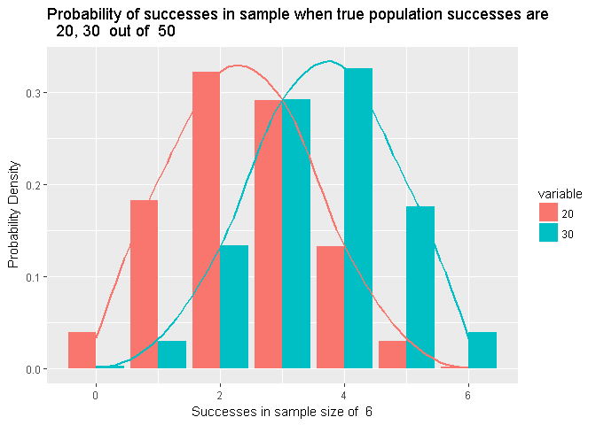
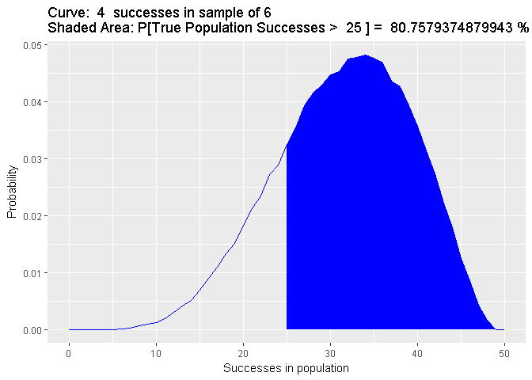

Hypergeometric Monte Carlo
================

This is a Monte Carlo sampling of the hypergeometric distribution

First load the libraries we will use

``` r
library(clusterSim)
library(ggplot2)
library(reshape2)
```

Information on R's hypergeometric distribution function can be found using this command

``` r
#?Hypergeometric
```

A function to Monte Carlo sample from a hypergeometric distribution

``` r
##  hg_mc - a function that monte carlo samples from a hypergeometric distribution
##  For each x in N, where N is the population size and x is the true number of successes in N, 
##  this function will draw a random sample of specified size (@sample) a specified number of times(@trials). 
##  @N - total population size
##  @samples - the number of samples drawn 
##  @trials - the number of times to perform independent random draws
##  @returns a dataframe witn N+1 columns (b/c 0 is included) and @samples+1 rows (O included)

hg_mc<-function(samples, N, trials){
  df <- NULL
  for (i in 0:N){
    df <- cbind(df, rhyper(trials, i, N-i, samples))
  }
  return(as.data.frame(df))
}
```

A helper function to aggregate the raw data from the simulations

``` r
#helper function to aggregate successes 

sums <- function(samples, df){
  sums<- NULL
  for (i in 1:(ncol(df))){
    res <- c()
    for (j in 0:samples){
      res <- c(res, sum(df[ ,i] == j))
    }
    sums <- cbind(sums, res)
  }
  return(sums)
}
```

First we set the parameters we want. Here we set a population of 50, sample size of 6, and 10,000 trials.

``` r
## Set desired parameters for the simulation
samples <- 6  # sample size
N <- 50 # population size 
trials <- 10000 # number of trials
```

We now run the simulation and aggregate the raw data

``` r
##  run the simulation
raw_data = hg_mc(samples, N, trials)

##  aggregate the data and rename the rows and cols
aggregated_data = sums(samples, raw_data)
colnames(aggregated_data) <- 0:N
rownames(aggregated_data) <- 0:samples
```

Let's look at the aggregated data. Each row is the observed number of successes in the sample. Each column is the true number of successes in the population.

``` r
print(aggregated_data)
```

    ##       0    1    2    3    4    5    6    7    8    9   10   11   12   13
    ## 0 10000 8786 7708 6782 5899 5165 4423 3949 3334 2874 2395 2023 1767 1477
    ## 1     0 1214 2184 2852 3444 3799 4102 4076 4332 4246 4162 3943 3727 3521
    ## 2     0    0  108  362  629  948 1293 1673 1878 2228 2555 2913 3020 3261
    ## 3     0    0    0    4   28   87  173  285  421  577  759  955 1255 1410
    ## 4     0    0    0    0    0    1    8   17   33   70  122  153  209  304
    ## 5     0    0    0    0    0    0    1    0    2    5    7   13   21   27
    ## 6     0    0    0    0    0    0    0    0    0    0    0    0    1    0
    ##     14   15   16   17   18   19   20   21   22   23   24   25   26   27
    ## 0 1239 1012  855  719  583  471  358  316  235  201  142  119   84   53
    ## 1 3324 3049 2828 2543 2295 1995 1750 1666 1358 1150 1059  851  656  531
    ## 2 3364 3478 3505 3465 3465 3395 3324 3135 2996 2855 2597 2403 2167 1994
    ## 3 1622 1857 2097 2346 2586 2812 2940 2969 3154 3156 3251 3317 3375 3249
    ## 4  402  532  624  786  890 1106 1287 1479 1731 2007 2164 2367 2604 2788
    ## 5   48   71   85  137  169  200  311  397  473  579  707  836  977 1170
    ## 6    1    1    6    4   12   21   30   38   53   52   80  107  137  215
    ##     28   29   30   31   32   33   34   35   36   37   38   39   40   41
    ## 0   44   35   28   10   10    9    8    2    0    0    0    0    0    0
    ## 1  493  375  281  220  177  127   99   66   58   28   15   10    8    4
    ## 2 1726 1544 1301 1193  880  767  647  489  386  305  237  163   83   58
    ## 3 3096 3075 2792 2811 2616 2325 2055 1813 1588 1425 1181  928  726  551
    ## 4 3001 3140 3337 3344 3491 3557 3545 3491 3482 3148 2993 2787 2598 2299
    ## 5 1416 1544 1852 1939 2249 2557 2877 3092 3292 3580 3798 3982 4151 4218
    ## 6  224  287  409  483  577  658  769 1047 1194 1514 1776 2130 2434 2870
    ##     42   43   44   45   46   47   48   49    50
    ## 0    0    0    0    0    0    0    0    0     0
    ## 1    4    0    0    0    0    0    0    0     0
    ## 2   42   20    9    3    0    0    0    0     0
    ## 3  407  266  182  100   29   12    0    0     0
    ## 4 2015 1591 1335  869  600  345  111    0     0
    ## 5 4352 4305 4080 3826 3464 2942 2195 1154     0
    ## 6 3180 3818 4394 5202 5907 6701 7694 8846 10000

Let's create some plots to help visualize the data First we write a function to plot the the distribution of the observed successes in a sample over the true number of successes in the population.

``` r
##  plotting function
##  df is a dataframe of normalized aggregate successes from simulation
pdf_plot <- function(df, N){
  sample_size = ncol(df)-1
  test <- df
  test['successes'] <- 0:N
  melted = melt(test, id.vars="successes")
  ggplot() + 
    geom_line(data=melted, aes(x=successes, y=value, group=variable, color = variable), size=1) +
    labs(title=paste("Sample Size of", sample_size, " "), x =paste("True number of successes in population size ", toString(N), sep=" "), y = "Probability density") +
    guides(color=guide_legend(title="Successes\nin Sample"))
}
```

Call the plotting function

``` r
##  normalize the results by successes in N to get a pdf
agg_data_normed <- data.Normalization(aggregated_data, type = "n10", normalization = "row")

##  plot the pdf's of the draw successes.  Data parameter is transposed and ensured to be a dataframe
pdf_plot(as.data.frame(t(agg_data_normed)), N)
```


This next plotting function is to examine the distribution of sample successes for a specific number of successes in the population. Multiple population successes are allowed for comparison.

``` r
##  To plot the distribution of successes in samples for a specified number of successes in the population
##  @successes - the number of successes in the population
##  @df - a data frame containing the data
##  @N - the population size
 
draw_dist_plot <-function(successes, df, N){
  sample_size = nrow(df) -1
  df <- df[c(successes, 'count')]
  melted <- melt(df, id.vars='count')
  ggplot(data=melted, aes(x=count, y=value, fill=variable)) +
    geom_bar(stat="identity", position=position_dodge()) +
    labs(title=paste('Probability of successes in sample when true population successes are \n ', toString(successes), ' out of ', N), x=paste('Successes in sample size of ', sample_size), y='Probability Density') +
    stat_smooth(aes(color=variable), method='auto', se = FALSE)
}
```

We first set the population successes that we want to look at. Here we choose 20 and 30.

``` r
##  Plot entire sample distribution for successes in N.
successes=c(20, 30)
```

We normalize the data and call the plotting function

``` r
##  first normalize by sample to get pmf and add successes column
samples_normed <- as.data.frame(data.Normalization(aggregated_data, type = "n10", normalization = "col"))
samples_normed['count'] = c(0:(nrow(samples_normed)-1))
##  plot the distribution over successes in draws for specified successes in N
draw_dist_plot(successes, samples_normed, N)
```

 If we want to examine a specific number of successes in a sample and find the likelihood of the true number of population successes we can plot the sample and sum the area under the curve. This function does that for the right tail of the distribution.

``` r
right_tail_plot <- function(df, sample_successes, pop_successes){
  sample_successes <- sample_successes +1
  df1 <- as.data.frame(t(df))
  df1['successes'] <- c(0:(nrow(df1)-1))
  shade <- df1[(pop_successes+1):nrow(df1),]
  prob <- 100* sum(shade[,sample_successes])
  ggplot(data=df1, aes(x=successes)) + geom_line(aes(y=df1[,sample_successes]), color='blue') + 
    geom_area(data=shade, aes(x=pop_successes:(nrow(df1)-1), y=shade[,sample_successes]), fill='blue') +
    labs(title=paste('Curve: ', sample_successes-1,' successes in sample of', toString(nrow(df)-1), '\nShaded Area: P[True Population Successes > ',
                     pop_successes, '] = ', prob, '%'), x='Successes in population', 
         y='Probability')
}
```

We then call the function based on the parameters we want to see. Here we are looking at 4 successes in the sample size of 6 where we want to know the probability that the true number of successes in the population is greater than 25. For a sample size or 6 with 4 successes, the probability that the true number of successes in the population of 50 is greater than 25 is 80.8%

``` r
##  parameters for plotting function
sample_successes <- 4 # number of successes in sample
pop_successes <- 25 # probability that true population successes are greater than this when observing sample_successes

right_tail_plot(agg_data_normed, sample_successes, pop_successes)
```


